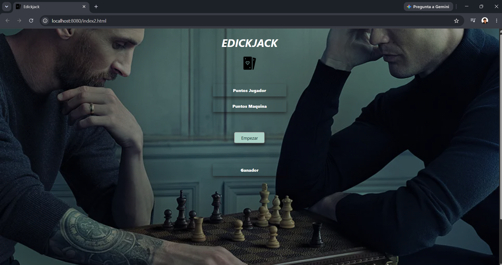
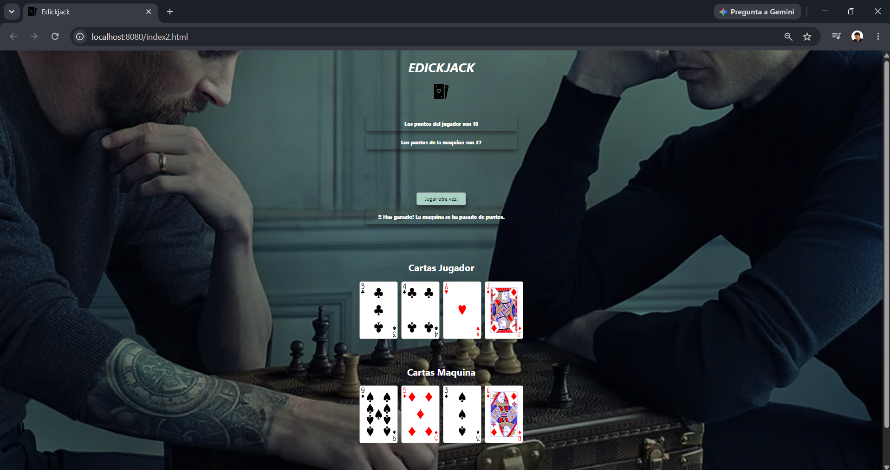

# 🃏 EDICKJACK

Un juego de cartas **Blackjack / 21** desarrollado con HTML, CSS y JavaScript Vanilla.

---

## 📸 Capturas de Pantalla

### Pantalla de Inicio


### Resultado de Partida


---

## 🎮 ¿Cómo Jugar?

1. **Empezar** – Haz clic en el botón *Empezar* para iniciar la partida. Se repartirán 2 cartas al jugador y 2 a la máquina.
2. **Pedir Carta** – Solicita una carta adicional para sumar más puntos. Puedes pedir hasta 5 cartas más.
3. **Plantarme** – Detén tu turno y revela el resultado. La máquina intentará alcanzar al menos 19 puntos.
4. **Ganador** – Gana quien esté más cerca de **21** sin pasarse. Si te pasas, pierdes automáticamente.
5. **Jugar Otra Vez** – Reinicia la partida con nuevas cartas.

---

## 🚀 Tecnologías

| Tecnología | Uso |
|---|---|
| HTML5 | Estructura de la página |
| CSS3 | Estilos y diseño responsivo |
| JavaScript (Vanilla) | Lógica del juego |
| SVG | Imágenes de las cartas |

---

## 📁 Estructura del Proyecto

```
Pagina-Juego-21/
├── index2.html           # Página principal del juego
├── css/
│   └── estilo.css        # Estilos de la interfaz
├── js/
│   └── blackjack.js      # Lógica del juego
└── imagenes/
    ├── cartas/           # 52 cartas en formato SVG
    └── ...               # Imágenes de fondo y logos
```

---

## ▶️ Ejecutar Localmente

```bash
# Con Python (cualquier versión)
python -m http.server 8080

# Luego abre en el navegador:
# http://localhost:8080/index2.html
```

---

## 👤 Autor

**Jonathan Pérez** · © 2023 EDICK Corp.
